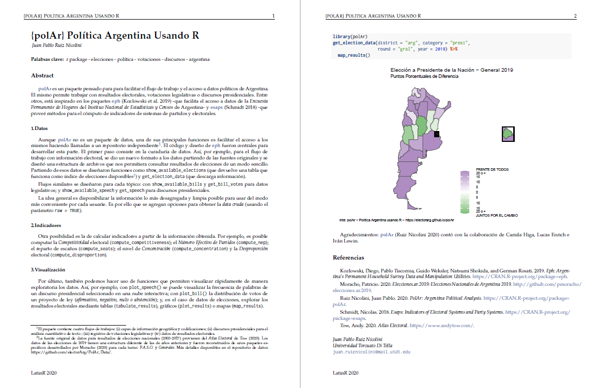

exclude: true

```{r setup, include=FALSE}
options(htmltools.dir.version = FALSE)

knitr::opts_chunk$set(collapse = TRUE,
                      fig.retina = 3,
                      out.width = 300, ### control plot size
                      cache = TRUE,
                      warning = FALSE,
                      message = FALSE)


knitr::knit_hooks$set(crop = knitr::hook_pdfcrop)

library(polAr)
library(tidyverse)

```


```{r xaringanExtra, echo=FALSE}
xaringanExtra::use_xaringan_extra(c("tile_view", "animate_css", "tachyons",
                                    "webcam", "panelset"))

xaringanExtra::use_webcam(width = 900, height = 400)
```


---

class: middle, center


## SESIÓN 11
#### Comunicación y Análisis Reproducible


#### [`r icon::fa("globe")`/MetodosCiPol/](https://tuqmano.github.io/MetodosCiPol/)

#### [`r icon::fa("github")`/MetodosCiPol/](https://github.com/TuQmano/MetodosCiPol)


---

# Ciencia de Datos:  


```{r, echo=FALSE, out.width="90%", fig.align='center'}
knitr::include_graphics("https://es.r4ds.hadley.nz/diagrams_w_text_as_path/es/data-science.svg")

```


---

# Ciencia de Datos:  

## Domar los Datos

```{r, echo=FALSE, out.width="90%", fig.align='center'}
knitr::include_graphics("https://es.r4ds.hadley.nz/diagrams_w_text_as_path/es/data-science-wrangle.svg")

```


---

# Ciencia de Datos:  

## Exploración de Datos

```{r, echo=FALSE, out.width="90%", fig.align='center'}
knitr::include_graphics("https://es.r4ds.hadley.nz/diagrams_w_text_as_path/es/data-science-explore.svg")

```


---

# Ciencia de Datos:  

## Programación 

```{r, echo=FALSE, out.width="90%", fig.align='center'}
knitr::include_graphics("https://es.r4ds.hadley.nz/diagrams_w_text_as_path/es/data-science-program.svg")

```


---

# Ciencia de Datos:  

### El final del ciclo: Comunicar 

```{r, echo=FALSE, out.width="90%", fig.align='center'}
knitr::include_graphics("https://es.r4ds.hadley.nz/diagrams_w_text_as_path/es/data-science-communicate.svg")

```

`r icon::fa("link")` <https://es.r4ds.hadley.nz/introducci%C3%B3n-18.html>


---

## `r icon::fa("book")` Referencias

* _Comunicar_ en  [R4DS](https://es.r4ds.hadley.nz/introducci%C3%B3n-18.html), **Grolemund y Wickham**

--

* [R Markdown: The Definivite Guide](https://bookdown.org/yihui/rmarkdown/), **Yihui Xie, J. J. Allaire y Garrett Grolemund** 

--

* [blogdown: Creating Websites with R Markdown](https://bookdown.org/yihui/blogdown/), **Yihui Xie, Amber Thomas y Alison Presmanes Hill **


---

background-image: url(https://github.com/rstudio/hex-stickers/raw/master/PNG/rmarkdown.png)
background-position: 95% 5%
background-size: 10%

## Un paquete para gobernarlos a todos

**[`{rmarkdown}`](https://github.com/rstudio/rmarkdown)**

--

* Hacer ciencia de datos de manera interactiva en la interfaz de _RStudio_

--

* Análisis Reproducible

--

* Compartir código y trabajo colaborativo

--

* Comunicar los resultados

--


**`r icon::fa("link")` [R Markdown - Documentación](https://rmarkdown.rstudio.com/articles.html)**

---
background-image: url(https://github.com/rstudio/hex-stickers/raw/master/PNG/rmarkdown.png)
background-position: 95% 5%
background-size: 10%

## Una manera de escribir 

### Muchas salidas posibles 


```{r, echo=FALSE, out.width="40%", fig.align="center"}
knitr::include_graphics("https://es.r4ds.hadley.nz/screenshots/rmarkdown-knit.png")

```

_knitear_ : `Ctrl + Shift + K`


`r icon::fa("link")` <https://es.r4ds.hadley.nz/formatos-de-r-markdown.html>


---
class: inverse, middle, center

# ¿Cómo es el proceso?

```{r, echo = FALSE, out.width="60%"}

knitr::include_graphics("https://es.r4ds.hadley.nz/images/RMarkdownFlow.png")


```

---
background-image: url(https://github.com/rstudio/hex-stickers/raw/master/PNG/rmarkdown.png)
background-position: 95% 5%
background-size: 10%

# Variantes de salidas

1. Documentos / Artículos 

2. _Dashboards_ 

3. Sitio web 

4. Presentaciones 

`r icon::fa("link")`  <https://rmarkdown.rstudio.com/formats.html>


---

# Ejemplos

####  1. [Artículos](https://github.com/TuQmano/latinr2020/)

Paquetes con plantillas para la edición de artículos para múltiples revistas académicas que sirven de base para diseñar plantillas propias como [`{rticles}`](https://github.com/rstudio/rticles) o [`{latinr}`](https://github.com/LatinR/latinr/) 

Presentación de `{polAr}` en LatinR 2020 usando plantilla de `{latinr}`
```{r, echo=FALSE, out.width="100%"}



```


---
background-image: url(https://user-images.githubusercontent.com/163582/45438104-ea200600-b67b-11e8-80fa-d9f2a99a03b0.png)
background-position: 95% 5%
background-size: 10%


# Ejemplos

#### 2. [Presentación](https://user-images.githubusercontent.com/163582/45438104-ea200600-b67b-11e8-80fa-d9f2a99a03b0.png)


* Presentaciones Ninja con [`{xaringan}`](https://github.com/yihui/xaringan) 

  +  [Slides](https://slides.yihui.org/xaringan/#1) 
  +  [Tutorial](https://xaringantutorial.netlify.app/)
  +  Múltiples extensiones con [`{xaringanExtra}`](https://pkg.garrickadenbuie.com/xaringanExtra) 
  +  Configurar estilos de filminas con [`{xaringanthemer}`](https://github.com/gadenbuie/xaringanthemer) 


---
background-image: url(https://camo.githubusercontent.com/d86fadc46868e607e1830c75a426bae16ef8edebea5c3037720404fe452f4c95/68747470733a2f2f626f6f6b646f776e2e6f72672f79696875692f626c6f67646f776e2f696d616765732f6c6f676f2e706e67)
background-position: 95% 5%
background-size: 10%


# Ejemplos

#### 3. [blog](https://github.com/TuQmano/tuqmano.com) 

Crear un sitio web en 5 minutos con [`{blogdown}`](https://bookdown.org/yihui/blogdown/)

```{r, eval=FALSE}

## Install from CRAN
install.packages('blogdown')

blogdown::new_site()  # Se pueden explorar templates para 
                      # sitios en https://themes.gohugo.io


```


Documentación completa disponible en <https://bookdown.org/yihui/blogdown/>


---

background-image: url(https://camo.githubusercontent.com/d7b356c04770e4e9844d1b46af430f4198b88f238761076128fd7434ae361bc2/68747470733a2f2f626f6f6b646f776e2e6f72672f79696875692f626f6f6b646f776e2f696d616765732f6c6f676f2e706e67)
background-position: 95% 5%
background-size: 10%


# Ejemplos

#### 4. **Libros**

Editar libros y publicarlos con [`{bookdown}`](https://bookdown.org/)

* generar _ebooks_ y documentos listos para impresión desde *RMarkdown*

* un lenguaje más fácil de aprender que $\LaTeX$ 

* múltiples opciones de salida (`.pdf`, $\LaTeX$, `HTML`, `EPUB`)

* posibilidad de incluir gráficos dinámicos y aplicaciones interactivas

* soporta otros lengügajes además de `R` como `Python` o `SQL`

* intergado al IDE `RStudio` 

* posibilidad de publicación en múltiples destinos (`github`, `bookdown.org`)


---

background-image: url(https://github.com/ismayc/thesisdown/raw/master/man/figures/thesisdown_hex.png)
background-position: 95% 5%
background-size: 10%


# Ejemplos

#### 5. **Tesis**

Usar [`{thesisdown}`](https://github.com/ismayc/thesisdown) como extensión del desarrollo de `{bookdown}` para generar plantillas de tesis con el formato requerido por distintos centros académicos. 


**Extra**: Plantilla en $\LaTeX$ para [Tesis de Maestría en Ciencia Política - Universidad Torcuato Di Tella](https://github.com/TuQmano/template_Thesis.UTDT)


