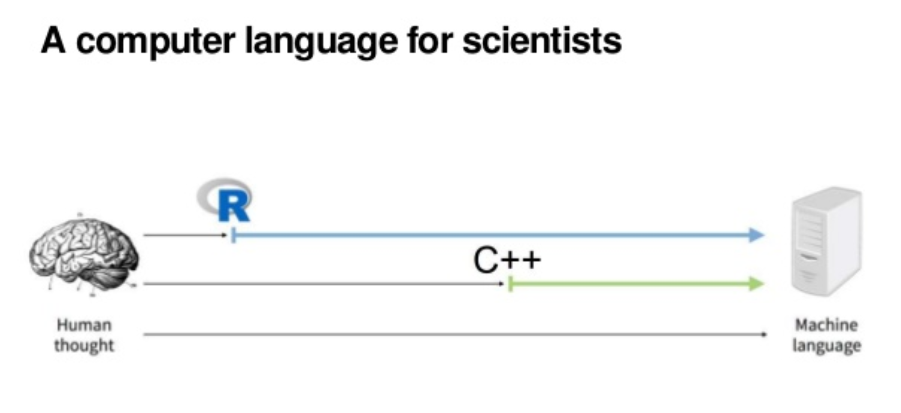

exclude: true

```{r setup, include=FALSE}
options(htmltools.dir.version = FALSE)

knitr::opts_chunk$set(collapse = TRUE,
                      fig.retina = 3,
                      out.width = 300, ### control plot size
                      cache = TRUE,
                      warning = FALSE,
                      message = FALSE)


library(polAr)
library(tidyverse)

```


```{r xaringanExtra, echo=FALSE}
xaringanExtra::use_xaringan_extra(c("tile_view", "animate_css", "tachyons",
                                    "webcam", "panelset"))
xaringanExtra::use_webcam(width = 900, height = 400)
```


```{r xaringan-themer, warning=FALSE, include=FALSE}
library(xaringanthemer)
style_mono_accent(
  base_color = "#0b9be3",
  header_font_google = google_font("Josefin Sans"),
  text_font_google   = google_font("Montserrat", "300", "300i"),
  code_font_google   = google_font("Fira Mono")
)

```


---

class: middle, center


## SESIÓN 2
### Introducción: Conociendo R + RStudio 

#### [`r icon::fa("globe")`/MetodosCiPol/](https://tuqmano.github.io/MetodosCiPol/)

#### [`r icon::fa("github")`/MetodosCiPol/](https://github.com/TuQmano/MetodosCiPol)

---

## `r icon::fa("book")`Referencias

1. _Comenzando con R y RStudio_, en "[Introducción a la Ciencia de Datos](https://rafalab.github.io/dslibro/getting-started.html)" (Irizarry, 2020).

2. _Prerequisitos_, en "[R para Ciencia de Datos](https://es.r4ds.hadley.nz/introducci%C3%B3n.html#prerrequisitos)" (Wickham y Grolemnud).

3. _R Básico_ en [Urdinez y Cruz](https://arcruz0.github.io/libroadp/basic-r.html); _Conociendo RStudio_ en  [Montané](https://bookdown.org/martinmontaneb/CienciaDeDatosParaCuriosos/introduccion-practica-a-la-ciencia-de-datos.html#conociendo-rstudio); y _Una presentación a toda marcha_ en [Vázquez Brust](https://bitsandbricks.github.io/ciencia_de_datos_gente_sociable/una-presentaci%C3%B3n-a-toda-marcha-de-r.html). 

---

background-image: url(https://cran.r-project.org/Rlogo.svg)
background-position: 95% 5%
background-size: 10%


## _El motor de la maquina_

```{r r, echo=F, out.width="80%"}
knitr::include_graphics("https://rafalab.github.io/dslibro/R/img/R_console.png")
```

---
background-image: url(https://d33wubrfki0l68.cloudfront.net/521a038ed009b97bf73eb0a653b1cb7e66645231/8e3fd/assets/img/rstudio-icon.png)
background-position: 95% 5%
background-size: 10%


## _**Tablero de control** (IDE)_


```{r rstudio, echo=F, out.width="100%"}
knitr::include_graphics("https://arcruz0.github.io/libroadp/00-images/basic-r/rstudio.png")
```

---
class: center, inverse, middle

# Empecemos _codeando_ !

## [`r icon::fa("link")` live_code.R](https://github.com/TuQmano/MetodosCiPol/blob/master/docs/Clase02/script/live_code.R)

---

background-image: url(https://github.com/rstudio/hex-stickers/raw/master/PNG/tidyverse.png)
background-position: 95% 5%
background-size: 10%

# `R base` vs _Tidyverse_


```{r curso}


curso <- data.frame(nombre= c("Juan", "Pedro", "María", "José", 
                               "Enzo", "Ariel", "Eva", "Domingo"),
                    edad= c(25, 32, 21,40, 
                             30, 28, 37, 25),
                    nacim= c(1993, 1986, 1997, 1978,
                              1988, 1990, 1981, 1993),
                    software.primario= c("spss", "stata", "stata", "excel", 
                                          "R", "stata", "spss", "stata"),
                    nivel= c(3, 5,7, 6,
                              2, 6, 8, 6) 
                    )


```


---

background-image: url(https://github.com/rstudio/hex-stickers/raw/master/PNG/tidyverse.png)
background-position: 95% 5%
background-size: 10%

# `R base`  vs _Tidyverse_ 


## Edad promedio del curso > BASE


```{r base_example}
# BASE
sum(curso$edad)/length(curso$edad)

```

---

background-image: url(https://github.com/rstudio/hex-stickers/raw/master/PNG/tidyverse.png)
background-position: 95% 5%
background-size: 10%

# `R base`  vs _Tidyverse_ 


## Edad promedio del curso > _Tidy_
```{r tidy_example}
# Tidy / {dplyr}

library(tidyverse) # cargo paqueteS

curso %>% 
  summarise(promedio = sum(edad)/length(edad))

```


---

background-image: url(https://github.com/electorArg/polAr/blob/master/hex/hex-polAr.png?raw=true)
background-position: 95% 5%
background-size: 10%

# Juntos por el Cambio 2019: 

### Parámetros de la elección?
 
```{r JxC, highlight.output=c(2, 9)}

library(polAr)

show_available_elections(viewer = F)


```


---

background-image: url(https://github.com/electorArg/polAr/blob/master/hex/hex-polAr.png?raw=true)
background-position: 95% 5%
background-size: 10%

## Descarga resultados 
### Presidente 2019 

```{r presi2019}

 get_election_data(district = 'arg', 
                  category = 'presi', #<<
                  round = 'gral', 
                  year = 2019)   #<<

```

---

background-image: url(https://github.com/electorArg/polAr/blob/master/hex/hex-polAr.png?raw=true)
background-position: 95% 5%
background-size: 10%

## Agrega nombre de listas

```{r presi2019+2}

gral2019 <- get_election_data(district = 'arg', 
                  category = 'presi', 
                  round = 'gral', 
                  year = 2019) %>%  
  get_names()  # AGREGO NOMRE DE LISTAS AL DF  #<<

gral2019

```


---

background-image: url(https://github.com/electorArg/polAr/blob/master/hex/hex-polAr.png?raw=true)
background-position: 95% 5%
background-size: 10%

### Dónde cosechó menos votos Juntos por el Cambio? 

#### Provincia con votos `min()` 


```{r}
jxc <- gral2019[gral2019$nombre_lista == 'JUNTOS POR EL CAMBIO', ] # > BASE

jxc <- as.data.frame(jxc) 

jxc[jxc$votos == min(jxc$votos),]


```

--

```{r}
gral2019 %>%  # > TIDY
  filter(nombre_lista == 'JUNTOS POR EL CAMBIO') %>% 
  ungroup() %>% 
  slice_min(votos)

```


---


# `r icon::fa("comment-dots")` vs `r icon::fa("laptop-code")`


```{r pc_human, echo=FALSE, fig.retina=3, out.width= "200%"}

```


---

background-image: url(https://github.com/rstudio/hex-stickers/raw/master/PNG/tidyverse.png)
background-position: 95% 5%
background-size: 10%


# Tidyverse

1. Reutilizar estructuras de datos existentes

2. Armar funciones simples con la _pipa_ (`%<%`)

3. Adoptar la programación funcional

4. Diseñado para humanos!


 [`r icon::fa("link")` The Manifesto](https://tidyverse.tidyverse.org/articles/manifesto.html)


---

background-image: url(https://github.com/rstudio/hex-stickers/raw/master/PNG/tidyverse.png)
background-position: 95% 5%
background-size: 10%


## El núcelo _Tidyverse_

```{r tidy_hex, echo=FALSE, fig.retina=3, out.width= "60%"}
knitr::include_graphics("fig/tidy_hex.PNG")
```

Fuente: [https://evamaerey.github.io/little_flipbooks_library/ggtextures/ggtextures#1](https://evamaerey.github.io/little_flipbooks_library/ggtextures/ggtextures#1)

--

```{r, eval=F}

# Install from CRAN
install.packages("tidyverse")
```

### [`r icon::fa("link")` The Tidyverse](https://tidyverse.tidyverse.org)

---

background-image: url(https://d33wubrfki0l68.cloudfront.net/521a038ed009b97bf73eb0a653b1cb7e66645231/8e3fd/assets/img/rstudio-icon.png)
background-position: 95% 5%
background-size: 10%


# Hastá acá

#### (1) Codeo

`r icon::fa("check-square")` `base`  vs *Tidyverse* 


# Lo que falta

#### (2) Organización de proyectos

`r icon::fa("arrow-right")`  `.Rproj` y `here::`

#### (3) Reproducibilidad y Comunicación

`r icon::fa("arrow-right")` `R` y `Rmd` 

---
class: center, inverse, middle


```{r rstudio_logo, echo=FALSE, fig.retina=3, out.width= "10%"}
knitr::include_graphics("https://d33wubrfki0l68.cloudfront.net/521a038ed009b97bf73eb0a653b1cb7e66645231/8e3fd/assets/img/rstudio-icon.png")
```

# (Extras)  


---

background-image: url(https://d33wubrfki0l68.cloudfront.net/521a038ed009b97bf73eb0a653b1cb7e66645231/8e3fd/assets/img/rstudio-icon.png)
background-position: 95% 5%
background-size: 10%


# .Rproj


```{r rproj, echo=FALSE, fig.retina=3, out.width= "60%"}
knitr::include_graphics("http://www.rstudio.com/images/docs/projects_new.png")
```

### [`r icon::fa("link")` Using Projects](https://support.rstudio.com/hc/en-us/articles/200526207-Using-Projects)


---

background-image: url(https://d33wubrfki0l68.cloudfront.net/521a038ed009b97bf73eb0a653b1cb7e66645231/8e3fd/assets/img/rstudio-icon.png)
background-position: 95% 5%
background-size: 10%


# {here}


```{r here, echo=FALSE, fig.retina=3, out.width= "60%"}
knitr::include_graphics("https://raw.githubusercontent.com/allisonhorst/stats-illustrations/master/rstats-artwork/here.png")
```

### [`r icon::fa("link")` {here}](https://here.r-lib.org/index.html)


---

background-image: url(https://d33wubrfki0l68.cloudfront.net/521a038ed009b97bf73eb0a653b1cb7e66645231/8e3fd/assets/img/rstudio-icon.png)
background-position: 95% 5%
background-size: 10%


# R Markdown


```{r rmd, echo=FALSE, fig.retina=3, out.width= "60%"}
knitr::include_graphics("https://d33wubrfki0l68.cloudfront.net/3215c7166555d2ac02ef678fd025c171f90db23c/4e60a/images/bandone.png")
```

### [`r icon::fa("link")` Comunicación](https://rmarkdown.rstudio.com/)


