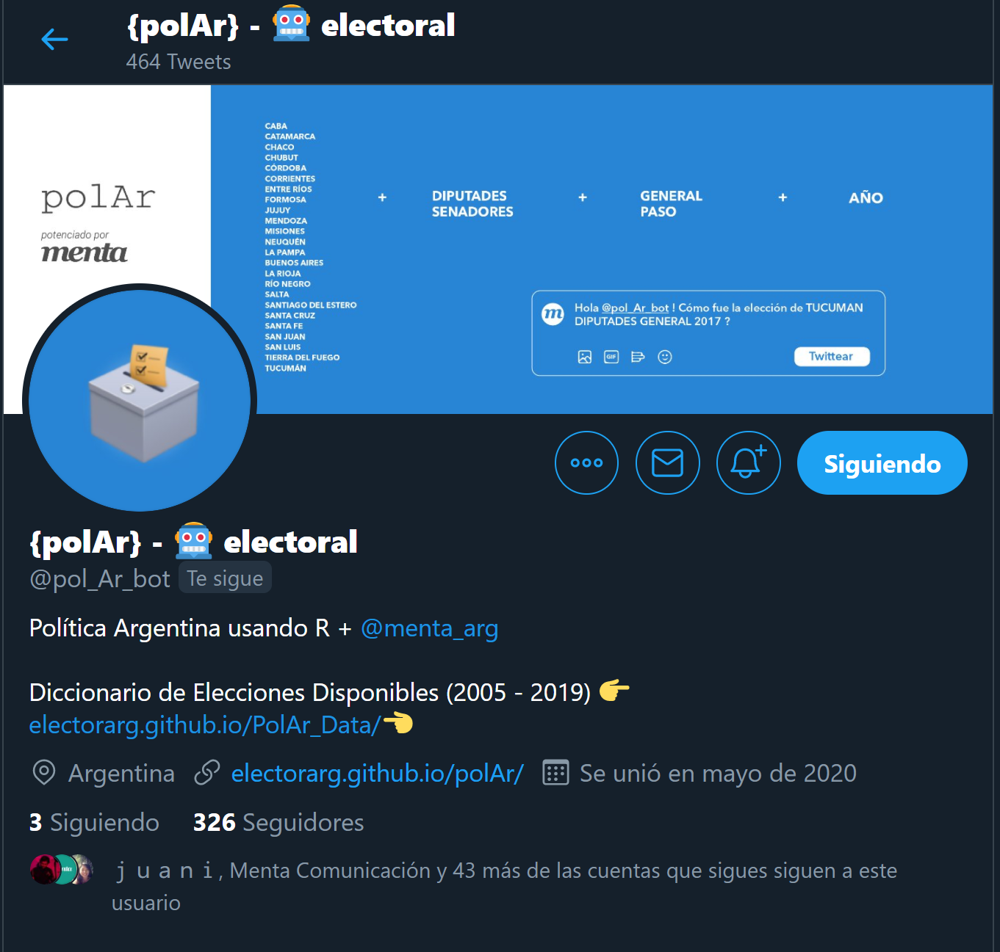

exclude: true

```{r setup, include=FALSE}
options(htmltools.dir.version = FALSE)

knitr::opts_chunk$set(collapse = TRUE,
                      fig.retina = 3,
                      out.width = 300, ### control plot size
                      ccache = TRUE,
                      warning = FALSE,
                      message = FALSE)


library(polAr)
library(tidyverse)

```


```{r xaringanExtra, echo=FALSE}
xaringanExtra::use_xaringan_extra(c("tile_view", "animate_css", "tachyons",
                                    "webcam", "panelset"))
xaringanExtra::use_webcam(width = 900, height = 400)
```


```{r xaringan-themer, warning=FALSE, include=FALSE}
library(xaringanthemer)
style_mono_accent(
  base_color = "#0b9be3",
  header_font_google = google_font("Josefin Sans"),
  text_font_google   = google_font("Montserrat", "300", "300i"),
  code_font_google   = google_font("Fira Mono")
)

```

---
class: center, middle


# J.P. Ruiz Nicolini 

### Politólogo<sup>2</sup> (UTDT)


####`->` [researchgate.net/juanpabloruiznicolini](https://www.researchgate.net/profile/Juan_Ruiz_Nicolini)


#### Áreas: 

#### **estudios electorales | reforma política  | métodos cuantitativos**

---

class: center, middle

# @TuQmano

### Cientista de Datos 

####{polAr} `->` [electorarg.github.io/polAr](https://electorarg.github.io/polAr/)


---
background-image: url("Clase1_files/manual_figs/tuqmanorR.png")
background-size: contain 
class: right, top, inverse

## `Ejemplo 1`
### [TuQmano.com](https://tuqmano.com)


---
class: inverse, center, middle

# Quienes son ustedes?

--

MACHETE: 

.pull-left[
```
* Nombre

* Formación

* Procedencia

* Programación / Software

* Intereses
```
]

--

.pull-right[
```
*  Juana Pérez

*  Socióloga

*  UBA / Santa Rosa, La Pampa

*  Excel / SPSS / Stata

*  Sindicatos y Mov. Sociales
```
]


---
### Ejemplo 2


.pull-left[
##  `r emojifont::emoji("robot")` electoral  

##### (con [Camila Higa](https://twitter.com/chig4_) - [mentaComuniación](https://twitter.com/menta_arg))

#### -> [`r icon::fa("twitter")`](https://twitter.com/pol_Ar_bot) [twitter.com/pol_Ar_bot](https://twitter.com/pol_Ar_bot) 
]


.pull-right[
```{r polar_bot, echo = FALSE, fig.align='center', out.width="100%"}
 
```
]


---


background-image: url(https://raw.githubusercontent.com/electorArg/polAr/master/hex/hex-polAr.png)
background-position: 90% 10%
background-size: 15%

### Ejemplo 3

## `r emojifont::emoji("package")``{polAr}`


* Facilita el acceso a datos políticos de Argentina 

* Provee herramientas para el análisis exploratorio, descarga, cálculos y visualización de la información.


--

`r emojifont::emoji("loudspeaker")` discursos presidenciales 

--


`r emojifont::emoji("raising_hand")`votaciones legislativas;

--


`r emojifont::emoji("earth_americas")` datos para análisis georeferenciados; 

--

`r emojifont::emoji("envelope")` resultados electorales;


--

#### Tipos de tareas


`r emojifont::emoji("mag")` EXPLORAR: funciones `show_*()` 

--

`r emojifont::emoji("inbox_tray")` DESCARGAR: funciones `get_*()`

--

`r emojifont::emoji("bar_chart")` VISUALIZAR: funciones `plot_*()`, `map_*()`,`tabulate_*()`


---

### `r emojifont::emoji("loudspeaker")` DISCURSOS

.panelset[

.panel[.panel-name[`r emojifont::emoji("mag")`Explorar]


```{r}
show_available_speech()
```

]

.panel[.panel-name[`r emojifont::emoji("inbox_tray")`Descargar]

.pull-left[
```{r speech_tidy}
get_speech(year = 1946) 
```
]

.pull-right[
```{r speech_raw}
get_speech(year = 1946, 
           raw = T) %>% #<<
  pull(discurso)
```

]


]

.panel[.panel-name[`r emojifont::emoji("bar_chart")`Visualizar]

.pull-left[

```{r, eval=F}
get_speech(year = 1946) %>% 
plot_speech() #<<
```

]

.pull-right[

```{r word_cloud, echo=F}

knitr::include_graphics(path = "Clase1_files/manual_figs/peron_1946.png")

```
]
]


]

---


### `r emojifont::emoji("raising_hand")` LEGISLATIVAS


.panelset[

.panel[.panel-name[`r emojifont::emoji("mag")`Explorar]

```{r bill_explore}
show_available_bills(viewer = F)  
```

]

.panel[.panel-name[`r emojifont::emoji("inbox_tray")`Descargar]


```{r bill_votes}
get_bill_votes(bill = "3507-Diputados") 
```

]


.panel[.panel-name[`r emojifont::emoji("bar_chart")`Visualizar]

Grafica el acumulado de opciones de una votación

.pull-left[
```{r bill_ggparliament_code, eval=F}
  plot_bill(id = "3507-Diputados") 
```
]

.pull.right[

```{r bill_ggparliament, echo=FALSE}
  plot_bill(id = "3507-Diputados") 
```


]
]
]

---

### `r emojifont::emoji("earth_americas")` GEO


.panelset[

.panel[.panel-name[`r emojifont::emoji("mag")`Explorar]

```{r codes_explore}
show_arg_codes(viewer = F)  # level = "departamento disponible
```

]

.panel[.panel-name[`r emojifont::emoji("inbox_tray")`Descargar Grilla]

.pull-left[
```{r grid code, eval = F}
get_grid(district = "TUCUMAN") %>% #<< 
  geofacet::grid_preview() 
```
]

.pull-right[
```{r grid, echo = F}
get_grid(district = "TUCUMAN") %>% 
  geofacet::grid_preview()
```
]

]

.panel[.panel-name[`r emojifont::emoji("inbox_tray")`Descargar geometry]

.pull-left[

```{r geo , eval = F}
get_geo(geo =  "TUCUMAN") %>%  #<<
  ggplot2::ggplot() +
  ggplot2::geom_sf()
```
]

.pull-right[

```{r geo plot, echo = F}
get_geo(geo =  "TUCUMAN") %>% 
  ggplot2::ggplot() +
  ggplot2::geom_sf(aes (label = coddepto))

```
]

]

]

---


### `r emojifont::emoji("envelope")` ELECCIONES


.panelset[
.panel[.panel-name[`r emojifont::emoji("mag")`Explorar]


```{r election_show}
show_available_elections() 
```

]

.panel[.panel-name[`r emojifont::emoji("inbox_tray")`Descargar]

```{r election_get}
get_election_data(district = "caba", category = "dip",
                  round = "gral", year =  2019) 
```

]


.panel[.panel-name[`r emojifont::emoji("bar_chart")`Graficar]


```{r election_plot}
get_election_data(district = "caba", category = "dip",
                  round = "gral", year =  2019) %>% 
  plot_results() #<<

```

]

.panel[.panel-name[`r emojifont::emoji("bar_chart")`Mapear]


```{r election_map}
get_election_data(district = "caba", category = "dip",
                  round = "gral", year =  2019,
                  level = "departamento") %>%  #<<
  map_results() #<<

```

]

.panel[.panel-name[`r emojifont::emoji("bar_chart")`Tabular]


```{r election_table}
get_election_data(district = "caba", category = "dip",
                  round = "gral", year =  2019) %>% 
  tabulate_results() #<<

```

]


]


---


### `r emojifont::emoji("envelope")` ELECCIONES


.panelset[

.panel[.panel-name[`r emojifont::emoji("computer")`Computar]


```{r election_seats}
get_election_data(district = "caba", category = "dip",
                  round = "gral", year =  2019) %>% 
  compute_seats() #<<

```


#### Otros cálculos en la familia de funciones  `compute_*`: 

 `compute_nep()`, `compute_competitiveness()`, `compute_disproportion()`, `compute_concentration()`

]

]

---
class: inverse, center. middle


# #MétodosCiPol 2020


---

# Historia de R

* Creado por **R**oss Ithaka y **R**obert Gentelman (1991 a 1993)

`S -> R`

--

* 2000: 1.0V

--

* 2011: Nace el entorno de desarrollo integrado (IDE) R Studio 

--

* 2020: 4.0V

--

> Más que lenguaje de programación R **_"es un dialecto de un lenguage de programación de los 70s"_** (S - Bell Laboratories: AT&T, Nokia...)<sup>1</sup>

.footnote[
[1] La cita y este repaso se basan en _slides_ de  [Germán Rosati](https://github.com/gefero/fund-prog-r/)
]

---

# Qué es R?

## LENGUAJE

- Multiplataforma (Win, Mac, Linux... PStation)

--

- Desarrollado por estadísticos para estadísticas

--

- Potente herramienta para generar Viz

--

- Funcionalidad de base + paquetes específicos

--

- Gran comunidad de usuaries colaborando

--

- **ES GRATIS!**


---

# Curso

* La bibliografía está disponible en el campus virtual. 

--

* Los `scripts` con código, _handouts_ y material extra estarán colgados luego de cada clase en un repositorio compartido en Dropbox con una carpeta correspondiente a cada sesión. 

--

* Compartiré el código en vivo para que puedan tener acceso desde un navegador de internet. 

--

* La evaluación del curso consistirá en la entrega de un informe con un análisis de datos replicando el flujo de trabajo que presentaremos en el taller (sesión 11). 

--

* A lo largo del curso deberán entregar algun(os) TP(s) intermedios (sesiones 5 y 9).
